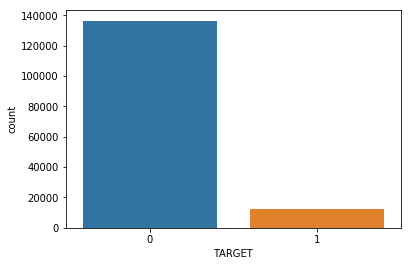
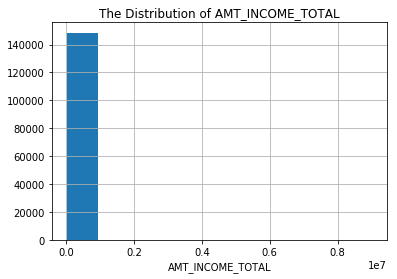
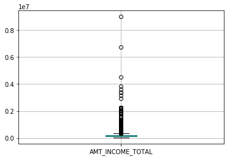
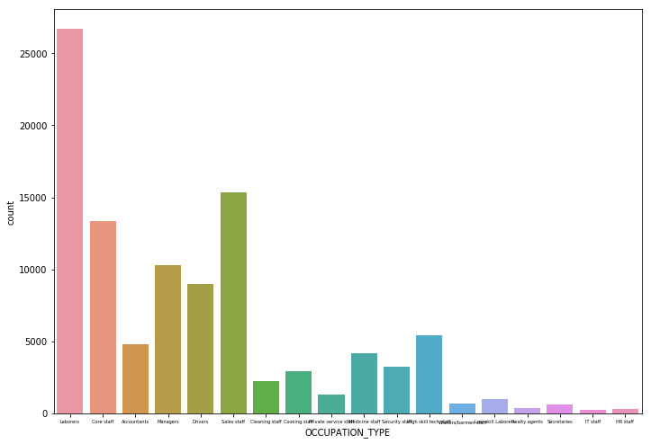
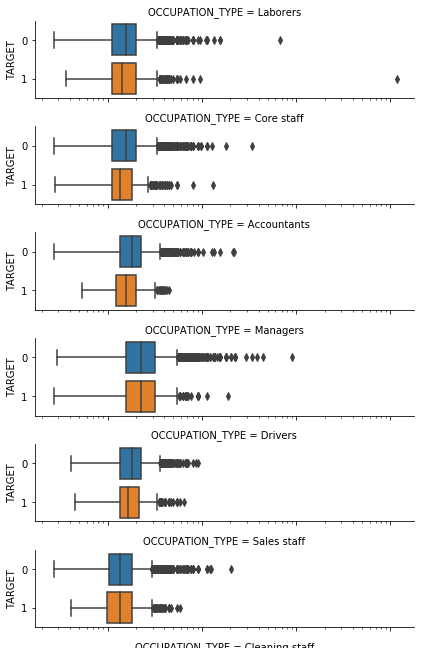
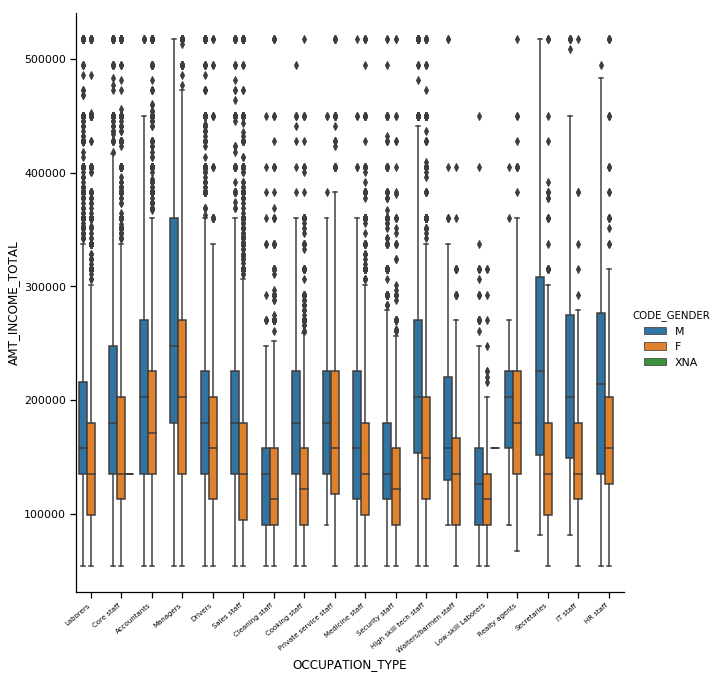

# Loan Defaulter Analysis :hand: fa18-523-71 fa18-523-59

| Uma Kota, Jatinkumar Bhutka
| umabkota@iu.edu, jdbhutka@iu.edu
| Indiana University Bloomington
| hid: fa18-523-71 fa18-523-59
| github: [:cloud:](https://github.com/cloudmesh-community/fa18-523-71/edit/master/project-report/report.md)
| code: Project report only

## Abstract

Classifying potential loan defaulters from potential clients is one of the most important probelms in banking sector today. Especially, when there is little or no data regarding the customers\' credit history, it's difficult to predict whether the client will be able to repay their loan amount.In 2018, Home Credit , an international non-bank, consumer finance group released a variety of data in a kaggle competetion to urge the datascience enthusiasts all over the world to come up with new models and predictions. If an optimal solution is achieved, it would help us understand the clients potential of repaying the loan and also help many potential clients get their loans sanctioned .To classify the defaulters, we have tried various approaches including PCA and Random Forests for feature selection and Random Forest, k-nn and XGBOOST for modelling with XGBOOST giving us the best results. To build the models, Jupyter Notebook IDE with a python 3.7 kernel was used on the cloud computing service Microsoft Azure. [@www-kagglehomecredit]

---

### Keywords: fa18-523-71, fa18-523-59, Exploratory Data Analysis, Python, Jupyter Notebook, Microsoft Azure, Classification, Credit, K-NN, Random Forest, PCA, XGBOOST 

---

## Introduction

## Data 
Home Credit released seven tables of data from different sources for this competition, but this project is confined to the main dataset which has features attributing to the loan, loan applicant and time of the loan. 

The main dataset has 307511 rows with each row representing individual loan application and 122 features (variables) including the TARGET which indicates if the loan is repaid (indicated by a 0) or not repaid (indicated by 1). For our project, we have taken the first 150000 rows for train and the next 30000 rows as the test dataset.

## Related work 

## Technologies used

## Exploratory Data Analysis 

The dataset with high dimensionality of 122 features required a series of univariate and bivariate anlayses to be conducted on it for us to understand the features and their relationship with each other.

* To begin with, we had to find the types of data the dataset comprises. We found out that of the 122 columns the dataset is made of 106 numeric and the rest of the 16 columns are categorical. Also, of the  106 numeric variables, 32 of them were Boolean.
* Number and percentage of missing values for each column were found to conduct missing value treatment on the dataset. 67 of the 122 columns had one or more missing values.
* The distribution of labels for the dependent variable,TARGET, was seen by plotting a countplot of the variable. It can be seen in the figure that the instances of repaid and not repaid are balanced. The instances where the customer has not repaid are very sparse making this problem a case of rare event modeling.

 {#fig:LabelDistributionofTarget}

* Distributions of the intuitively important variables were also plotted to check for outliers and skewedness and it was found that many variables exhibited skewed distributions with outliers. In the figure +@fig:AMT_INCOME_TOTAL_dist, the histogram plot, shows the distribution of AMT\_INCOME\_TOTAL which captures total income of the applicant. In the figure +@fig:AMT_INCOME_TOTAL_outlier, the barplot shows the range of the feature and the outliers that lie outside the IQR (Inter Quartile Range) 

 {#fig:AMT_INCOME_TOTAL_dist}

 {#fig:AMT_INCOME_TOTAL_outlier}

Distribution of the categorical variable,OCCUPATION\_TYPE, can be seen in +@fig:OCCtypedist

 {#fig:OCCtypedist}

* Various bivariate analyses were also conducted to understand the relationship between the dependent and independent variables and relationships in between independent variables and to make sure no multi-collinearity exists in the dataset before we conduct statistical modeling. +@fig:extsource3target shows the variance of the EXT\_SOURCE3 variable with respect to the dependent variable and +@fig:occ_target_bivariate shows the same for the variable OCCUPATION\_TYPE

 {#fig:extsource3target}

 {#fig:occ_target_bivariate}

+@fig:occgender shows the relationship between gender, occupation type and income

 {#fig:occgender}

* Correalations between the variables were found before heading to feature selection.

## Feature Engineering

## Modeling

## Results

## Conclusion

## Acknowledgment
We would like to thank professor Dr. Gregor von Laszewski for helping us with the problem statement and dataset selection and also for all the guidance he has provided us during the coursework. We would also like to thank the associate instructors for helping us and guiding us. 
